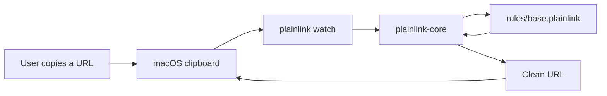

# PlainLink

Clean copied links before you share them.

PlainLink is a local-first URL cleaner. The MVP is a Rust command line tool with a portable cleaning engine and a macOS clipboard watcher. The project goal is to become a community-maintained, ad-blocker-list-style ruleset for removing tracking parameters from copied URLs.



## Status

PlainLink is early MVP software.

- Cleans URLs from the CLI with `plainlink clean`.
- Explains removed parameters with `plainlink inspect`.
- Restores the last cleaned original URL with `plainlink restore`.
- Watches the macOS clipboard with `plainlink watch`.
- Installs PlainLink as a user LaunchAgent with `plainlink agent install`.
- Validates community rule behavior with fixture-backed tests.
- Uses conservative rules that preserve unknown parameters by default.

## Quick Start

```sh
cargo test
cargo run -- clean 'https://youtu.be/LYa_ReqRlcs?si=VC4qVB_EUC90uwbo'
cargo run -- inspect 'https://example.com/read?utm_source=newsletter&id=42'
cargo run -- restore
cargo run -- agent status
```

Expected output:

```text
https://youtu.be/LYa_ReqRlcs
```

To watch the macOS clipboard:

```sh
cargo run -- watch --interval-ms 500
```

To install the watcher as a user LaunchAgent:

```sh
cargo run -- agent install --interval-ms 500
```

## Project Layout

```text
src/
  agent.rs        macOS LaunchAgent management
  cleaner.rs      URL cleaning engine
  rules.rs        PlainLink rule parser and matcher
  clipboard.rs    macOS clipboard watcher adapter
  state.rs        Last-cleaned URL restore state
  main.rs         CLI entrypoint
rules/
  base.plainlink  Default community rules
tests/
  fixtures/       Rule behavior fixtures used by cargo test
docs/
  ARCHITECTURE.md System design and data flow
  RULES.md        Rule syntax and contribution guidance
  MACOS.md        LaunchAgent notes
```

## Contributing

Rules are intentionally readable. A rule PR should include:

- the dirty URL,
- the expected cleaned URL,
- why the parameter is safe to remove,
- a fixture in `tests/fixtures/`.

Start with [CONTRIBUTING.md](CONTRIBUTING.md), then read [docs/RULES.md](docs/RULES.md).
