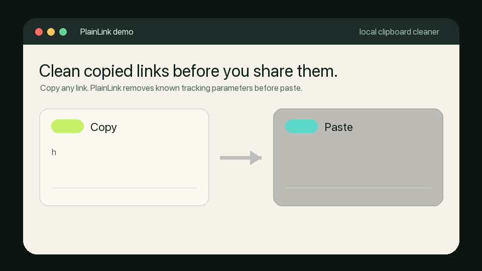
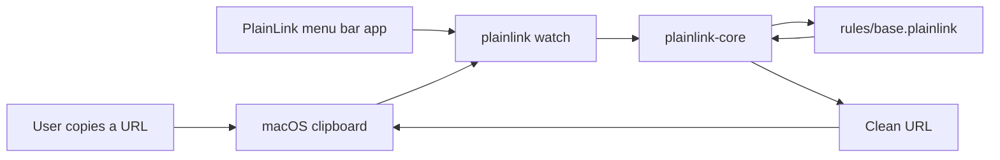

# PlainLink

Clean copied links before you share them.

PlainLink automatically removes known tracking parameters from URLs in your Mac clipboard. Everything happens locally.

[Download for macOS](https://github.com/HexCodeYT/PlainLink/releases) · [Build from source](#build-from-source) · [View source](https://github.com/HexCodeYT/PlainLink)

- Free and open source
- No accounts
- No telemetry
- No network required
- Unknown parameters are preserved
- Restore the original URL anytime



```text
Copy:
https://example.com/article?id=42&utm_source=newsletter&fbclid=abc

Paste:
https://example.com/article?id=42
```

PlainLink is the open-source, local-first URL-cleaning engine with transparent, community-maintained rules. The native Mac utility is the first product surface; the Rust core and rule format are designed to stay portable.

## macOS Status

PlainLink is functional developer-preview software. It is ready for technical testers who are comfortable with source builds or unsigned macOS apps, but it is not yet a regular-user notarized release.

- The app already cleans, inspects, watches, and restores clipboard URLs.
- Unsigned preview zips are for testers and CI artifacts.
- Regular-user downloads should wait for a Developer ID-signed and notarized build.
- If the [Releases](https://github.com/HexCodeYT/PlainLink/releases) page is empty, build from source for now.

macOS Gatekeeper will warn on unsigned preview builds because they are not signed with a Developer ID certificate or notarized by Apple.

## Install

### Download a macOS preview

Published builds will appear on the [GitHub Releases](https://github.com/HexCodeYT/PlainLink/releases) page as a single obvious macOS zip with a matching `.sha256` checksum.

### Build from source

```sh
cargo test
cargo run -- clean 'https://youtu.be/LYa_ReqRlcs?si=VC4qVB_EUC90uwbo'
cargo run -- inspect 'https://example.com/read?utm_source=newsletter&id=42'
cargo run -- install --interval-ms 500
```

Expected clean output:

```text
https://youtu.be/LYa_ReqRlcs
```

To watch the macOS clipboard without installing:

```sh
cargo run -- watch --interval-ms 500
```

To clean the current clipboard once or restore the last original URL:

```sh
cargo run -- clean-clipboard
cargo run -- restore
```

## What It Does

- Cleans URLs from the CLI with `plainlink clean`.
- Explains removed parameters with `plainlink inspect`.
- Restores the last cleaned original URL with `plainlink restore`.
- Watches the macOS clipboard with `plainlink watch`.
- Cleans the current clipboard once with `plainlink clean-clipboard`.
- Provides a native macOS menu bar app built with Apple Command Line Tools.
- Installs PlainLink to a stable user path with `plainlink install`.
- Installs PlainLink as a user LaunchAgent with `plainlink agent install`.
- Compiles conservative external rule-source subsets with reproducible manifests.
- Verifies native and imported rule behavior with `plainlink-rules verify-fixtures`.
- Uses conservative rules that preserve unknown parameters by default.

## How It Works



## Developer Quick Start

```sh
cargo fmt --check
cargo test
cargo clippy --all-targets -- -D warnings
cargo run -- doctor
cargo run -- agent status
cargo run --bin plainlink-rules -- help
cargo run --bin plainlink-rules -- verify-fixtures
```

To build and smoke-test the native macOS menu bar app:

```sh
scripts/test-macos-app.sh
```

This creates `dist/PlainLink.app`.

To build a local unsigned release zip:

```sh
scripts/package-macos-app.sh
```

This creates `dist/packages/PlainLink-<version>-macos-<arch>.zip` and a `.sha256` checksum.

For a preview-tagged artifact, pass the preview version explicitly:

```sh
PLAINLINK_RELEASE_VERSION=v0.1.0-preview.2 scripts/package-macos-app.sh
```

To create a signed and notarized macOS release build, configure a Developer ID signing identity and notary profile, then run:

```sh
scripts/release-macos-app.sh
```

See [docs/RELEASE.md](docs/RELEASE.md).

## Rule Contributions

Found a tracking parameter PlainLink should remove? Open a rule request with:

- the dirty URL,
- the expected clean URL,
- why the parameter is safe to remove,
- any required parameters that must stay.

Rules are intentionally readable. A rule PR should also include a fixture in `tests/fixtures/`.

Start with [CONTRIBUTING.md](CONTRIBUTING.md), then read [docs/RULES.md](docs/RULES.md).

## External Rule Sources

To compile a safe subset from an external source and write a manifest:

```sh
cargo run --bin plainlink-rules -- import-clearurls \
  --input clearurls-data.minify.json \
  --output rules/generated/clearurls.plainlink \
  --manifest rules/generated/clearurls.manifest \
  --source-revision <upstream-sha>
```

Before generated rules are considered for shipping, verify the native fixture corpus and then verify it again with the generated rules merged in:

```sh
cargo run --bin plainlink-rules -- verify-fixtures
cargo run --bin plainlink-rules -- verify-fixtures --rules rules/generated/clearurls.plainlink
```

## Distribution

Current recommended distribution path:

- Technical testers: build from source or use an explicitly unsigned preview zip.
- Regular users: wait for a Developer ID-signed and notarized release.
- GitHub Release: publish only when the artifact is clearly labeled as unsigned preview, or when the signed/notarized release script has produced the final zip.

Developer ID signing and notarization require Apple Developer Program membership. PlainLink does not currently assume that cost is worth paying before there is enough tester demand.

See [docs/LAUNCH.md](docs/LAUNCH.md) for the discovery and first-launch checklist.

## Project Layout

```text
app/
  macos/PlainLinkMenu  Swift/AppKit menu bar app
src/
  agent.rs        macOS LaunchAgent management
  cleaner.rs      URL cleaning engine
  install.rs      Stable user install and doctor checks
  rules.rs        PlainLink rule parser and matcher
  clipboard.rs    macOS clipboard watcher adapter
  state.rs        Last-cleaned URL restore state
  main.rs         CLI entrypoint
rules/
  base.plainlink  Default community rules
  sources.toml    External rule source metadata
tests/
  fixtures/       Rule behavior fixtures used by cargo test
docs/
  ARCHITECTURE.md System design and data flow
  RULES.md        Rule syntax and contribution guidance
  RULE_SOURCES.md External source compiler notes
  RELEASE.md      Signed macOS release process
  LAUNCH.md       Discovery and first-launch checklist
  MACOS.md        LaunchAgent notes
  MENUBAR.md      Native menu bar app notes
scripts/
  build-macos-app.sh  Build dist/PlainLink.app
  generate-macos-icon.sh Generate PlainLink.icns
  test-macos-app.sh   Build and smoke-test the app bundle
  package-macos-app.sh Create an unsigned zip and checksum
  release-macos-app.sh Sign, notarize, staple, and package
  publish-github-release.sh Publish a draft GitHub Release
```
