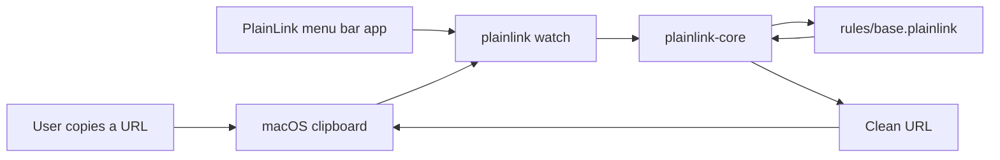

# PlainLink

Clean copied links before you share them.

PlainLink is a local-first copied-link cleaner for macOS. It ships as a Rust CLI, a user-level clipboard watcher, and a native Swift/AppKit menu bar app. The project goal is to become a community-maintained, ad-blocker-list-style ruleset for removing tracking parameters from copied URLs at the system clipboard level.



## Current Status

PlainLink is functional developer-preview software. It is ready for technical testers who are comfortable with source builds or unsigned macOS apps, but it is not yet a regular-user notarized release.

- Cleans URLs from the CLI with `plainlink clean`.
- Explains removed parameters with `plainlink inspect`.
- Restores the last cleaned original URL with `plainlink restore`.
- Watches the macOS clipboard with `plainlink watch`.
- Cleans the current clipboard once with `plainlink clean-clipboard`.
- Provides a native macOS menu bar app built with Apple Command Line Tools.
- Ships menu bar app icon generation and first-run guidance.
- Installs PlainLink to a stable user path with `plainlink install`.
- Installs PlainLink as a user LaunchAgent with `plainlink agent install`.
- Compiles conservative external rule-source subsets with reproducible manifests.
- Verifies native and imported rule behavior with `plainlink-rules verify-fixtures`.
- Builds unsigned macOS zip packages for testing and CI artifacts.
- Has signed/notarized release automation ready, but no Developer ID certificate is configured.
- Validates community rule behavior with fixture-backed tests.
- Uses conservative rules that preserve unknown parameters by default.

## Quick Start

```sh
cargo test
cargo run -- clean 'https://youtu.be/LYa_ReqRlcs?si=VC4qVB_EUC90uwbo'
cargo run -- inspect 'https://example.com/read?utm_source=newsletter&id=42'
cargo run -- clean-clipboard
cargo run -- restore
cargo run -- doctor
cargo run -- agent status
cargo run --bin plainlink-rules -- help
cargo run --bin plainlink-rules -- verify-fixtures
```

Expected output:

```text
https://youtu.be/LYa_ReqRlcs
```

To watch the macOS clipboard:

```sh
cargo run -- watch --interval-ms 500
```

To install PlainLink to a stable user path and start the watcher:

```sh
cargo run -- install --interval-ms 500
```

To build and smoke-test the native macOS menu bar app:

```sh
scripts/test-macos-app.sh
```

This creates `dist/PlainLink.app`.

To build a local unsigned release zip:

```sh
scripts/package-macos-app.sh
```

This creates `dist/packages/PlainLink-<version>-macos-<arch>.zip` and a `.sha256` checksum.

This zip is for developer-preview testing. macOS Gatekeeper will warn because the app is not signed with a Developer ID certificate or notarized by Apple.

For a preview-tagged artifact, pass the preview version explicitly:

```sh
PLAINLINK_RELEASE_VERSION=v0.1.0-preview.2 scripts/package-macos-app.sh
```

To compile a safe subset from an external source and write a manifest:

```sh
cargo run --bin plainlink-rules -- import-clearurls \
  --input clearurls-data.minify.json \
  --output rules/generated/clearurls.plainlink \
  --manifest rules/generated/clearurls.manifest \
  --source-revision <upstream-sha>
```

Before generated rules are considered for shipping, verify the native fixture corpus and then verify it again with the generated rules merged in:

```sh
cargo run --bin plainlink-rules -- verify-fixtures
cargo run --bin plainlink-rules -- verify-fixtures --rules rules/generated/clearurls.plainlink
```

To create a signed and notarized macOS release build, configure a Developer ID signing identity and notary profile, then run:

```sh
scripts/release-macos-app.sh
```

See [docs/RELEASE.md](docs/RELEASE.md).

## Distribution

Current recommended distribution path:

- Technical testers: build from source or use an explicitly unsigned preview zip.
- Regular users: wait for a Developer ID-signed and notarized release.
- GitHub Release: publish only when the artifact is clearly labeled as unsigned preview, or when the signed/notarized release script has produced the final zip.

Developer ID signing and notarization require Apple Developer Program membership. PlainLink does not currently assume that cost is worth paying before there is enough tester demand.

## Project Layout

```text
app/
  macos/PlainLinkMenu  Swift/AppKit menu bar app
src/
  agent.rs        macOS LaunchAgent management
  cleaner.rs      URL cleaning engine
  install.rs      Stable user install and doctor checks
  rules.rs        PlainLink rule parser and matcher
  clipboard.rs    macOS clipboard watcher adapter
  state.rs        Last-cleaned URL restore state
  main.rs         CLI entrypoint
rules/
  base.plainlink  Default community rules
  sources.toml    External rule source metadata
tests/
  fixtures/       Rule behavior fixtures used by cargo test
docs/
  ARCHITECTURE.md System design and data flow
  RULES.md        Rule syntax and contribution guidance
  RULE_SOURCES.md External source compiler notes
  RELEASE.md      Signed macOS release process
  MACOS.md        LaunchAgent notes
  MENUBAR.md      Native menu bar app notes
scripts/
  build-macos-app.sh  Build dist/PlainLink.app
  generate-macos-icon.sh Generate PlainLink.icns
  test-macos-app.sh   Build and smoke-test the app bundle
  package-macos-app.sh Create an unsigned zip and checksum
  release-macos-app.sh Sign, notarize, staple, and package
  publish-github-release.sh Publish a draft GitHub Release
```

## Contributing

Rules are intentionally readable. A rule PR should include:

- the dirty URL,
- the expected cleaned URL,
- why the parameter is safe to remove,
- a fixture in `tests/fixtures/`.

Start with [CONTRIBUTING.md](CONTRIBUTING.md), then read [docs/RULES.md](docs/RULES.md).
