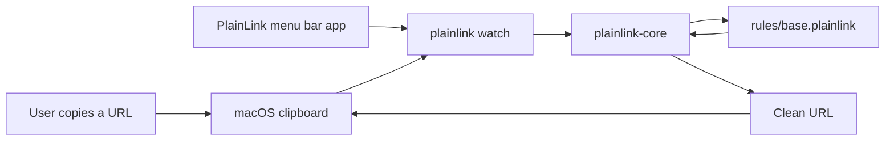

# PlainLink

Clean copied links before you share them.

PlainLink automatically removes known tracking parameters from URLs in your Mac clipboard. Everything happens locally.

[Install the developer preview](#install-the-developer-preview) · [Build from source](#build-from-source) · [View source](https://github.com/HexCodeYT/PlainLink)

- Free and open source
- No accounts or analytics
- No network requests
- No browser extension
- Unknown parameters are preserved
- Restore the original URL anytime

Runs locally. No accounts, network requests, analytics, or browser extension required.


| Service | Copied URL | Cleaned URL |
| --- | --- | --- |
| YouTube | `youtube.com/watch?v=dQw4w9WgXcQ&si=share123&utm_source=copy` | `youtube.com/watch?v=dQw4w9WgXcQ` |
| Amazon Australia | `amazon.com.au/dp/B08N5WRWNW?tag=affiliate-22&qid=1720000000&th=1` | `amazon.com.au/dp/B08N5WRWNW?th=1` |
| Spotify | `open.spotify.com/track/4cOdK2wGLETKBW3PvgPWqT?si=abc123&utm_medium=share` | `open.spotify.com/track/4cOdK2wGLETKBW3PvgPWqT` |

PlainLink is the open-source, local-first URL-cleaning engine with transparent, community-maintained rules. The native Mac utility is the first product surface; the Rust core and rule format are designed to stay portable.

## Install the developer preview

> [!WARNING]
> PlainLink is early developer-preview software for technical testers. The app is ad-hoc signed, but it is not yet Developer ID-signed or notarized. macOS Gatekeeper will warn on first launch. Please expect rough edges and report incorrect URL changes.

1. Open [GitHub Releases](https://github.com/HexCodeYT/PlainLink/releases) and download the ZIP for your Mac:
   - The file ending in `-macos-arm64.zip` for Apple silicon (M1, M2, M3, M4, or newer).
   - The file ending in `-macos-x86_64.zip` for an Intel Mac.
2. Open the ZIP and drag `PlainLink.app` into `/Applications`.
3. In Finder, open **Applications**, Control-click `PlainLink`, choose **Open**, then choose **Open** again.
4. PlainLink appears in the menu bar and starts watching copied URLs.

If macOS does not show the second **Open** button, try launching PlainLink once, then go to **System Settings → Privacy & Security**, find the blocked-app message, and choose **Open Anyway**.

If the [Releases](https://github.com/HexCodeYT/PlainLink/releases) page has no ZIP for your Mac, use the source build below. Signing and notarisation are pending; the preview ZIP and its checksum will be clearly labelled on the release.

### Build from source

Requires Rust and Apple Command Line Tools. This builds and launches the native menu bar app:

```sh
scripts/build-macos-app.sh
open dist/PlainLink.app
```

For the CLI and test suite:

```sh
cargo test
cargo run -- clean 'https://youtu.be/LYa_ReqRlcs?si=VC4qVB_EUC90uwbo'
cargo run -- inspect 'https://example.com/read?utm_source=newsletter&id=42'
```

Expected clean output:

```text
https://youtu.be/LYa_ReqRlcs
```

To watch the macOS clipboard without installing:

```sh
cargo run -- watch --interval-ms 500
```

To clean the current clipboard once or restore the last original URL:

```sh
cargo run -- clean-clipboard
cargo run -- restore
```

## What It Does

- Cleans URLs from the CLI with `plainlink clean`.
- Explains removed parameters with `plainlink inspect`.
- Restores the last cleaned original URL with `plainlink restore`.
- Watches the macOS clipboard with `plainlink watch`.
- Cleans the current clipboard once with `plainlink clean-clipboard`.
- Provides a native macOS menu bar app built with Apple Command Line Tools.
- Installs PlainLink to a stable user path with `plainlink install`.
- Installs PlainLink as a user LaunchAgent with `plainlink agent install`.
- Compiles conservative external rule-source subsets with reproducible manifests.
- Verifies native and imported rule behavior with `plainlink-rules verify-fixtures`.
- Uses conservative rules that preserve unknown parameters by default.

## How It Works


```mermaid
flowchart LR
    Copy["User copies a URL"] --> Clipboard["macOS clipboard"]
    Menu["PlainLink menu bar app"] --> Watcher["plainlink watch"]
    Clipboard --> Watcher
    Watcher --> Engine["plainlink-core"]
    Engine --> Rules["rules/base.plainlink"]
    Rules --> Engine
    Engine --> Cleaned["Clean URL"]
    Cleaned --> Clipboard
```

## Current Status

PlainLink is functional developer-preview software. It is ready for technical testers who are comfortable with source builds or ad-hoc-signed, unnotarized macOS apps, but it is not yet a regular-user notarized release.

- Cleans URLs from the CLI with `plainlink clean`.
- Explains removed parameters with `plainlink inspect`.
- Restores the last cleaned original URL with `plainlink restore`.
- Watches the macOS clipboard with `plainlink watch`.
- Cleans the current clipboard once with `plainlink clean-clipboard`.
- Provides a native macOS menu bar app built with Apple Command Line Tools.
- Ships menu bar app icon generation and first-run guidance.
- Installs PlainLink to a stable user path with `plainlink install`.
- Installs PlainLink as a user LaunchAgent with `plainlink agent install`.
- Compiles conservative external rule-source subsets with reproducible manifests.
- Verifies native and imported rule behavior with `plainlink-rules verify-fixtures`.
- Builds ad-hoc-signed, unnotarized macOS zip packages for testing and CI artifacts.
- Has signed/notarized release automation ready, but no Developer ID certificate is configured.
- Validates community rule behavior with fixture-backed tests.
- Uses conservative rules that preserve unknown parameters by default.

## Quick Start

```sh
cargo fmt --check
cargo test
cargo clippy --all-targets -- -D warnings
cargo run -- doctor
cargo run -- agent status
cargo run --bin plainlink-rules -- help
cargo run --bin plainlink-rules -- verify-fixtures
```

To build and smoke-test the native macOS menu bar app:

```sh
scripts/test-macos-app.sh
```

This creates `dist/PlainLink.app`.

To build a local ad-hoc-signed preview zip:

```sh
scripts/package-macos-app.sh
```

This creates `dist/packages/PlainLink-<version>-macos-<arch>.zip` and a `.sha256` checksum.

For a preview-tagged artifact, pass the preview version explicitly:

```sh
PLAINLINK_RELEASE_VERSION=v0.1.0-preview.2 scripts/package-macos-app.sh
```

To create a signed and notarized macOS release build, configure a Developer ID signing identity and notary profile, then run:

```sh
scripts/release-macos-app.sh
```

See [docs/RELEASE.md](docs/RELEASE.md).

## Rule Contributions

Found a tracking parameter PlainLink should remove? Open a rule request with:

- the dirty URL,
- the expected clean URL,
- why the parameter is safe to remove,
- any required parameters that must stay.

Rules are intentionally readable. A rule PR should also include a fixture in `tests/fixtures/`.

Start with [CONTRIBUTING.md](CONTRIBUTING.md), then read [docs/RULES.md](docs/RULES.md).

## External Rule Sources

To compile a safe subset from an external source and write a manifest:

```sh
cargo run --bin plainlink-rules -- import-clearurls \
  --input clearurls-data.minify.json \
  --output rules/generated/clearurls.plainlink \
  --manifest rules/generated/clearurls.manifest \
  --source-revision <upstream-sha>
```

Before generated rules are considered for shipping, verify the native fixture corpus and then verify it again with the generated rules merged in:

```sh
cargo run --bin plainlink-rules -- verify-fixtures
cargo run --bin plainlink-rules -- verify-fixtures --rules rules/generated/clearurls.plainlink
```

## Distribution

Current recommended distribution path:

- Technical testers: build from source or use an explicitly ad-hoc-signed, unnotarized preview zip.
- Regular users: wait for a Developer ID-signed and notarized release.
- GitHub Release: publish only when the artifact is clearly labeled as an ad-hoc-signed, unnotarized preview, or when the Developer ID-signed/notarized release script has produced the final zip.

Developer ID signing and notarization require Apple Developer Program membership. PlainLink does not currently assume that cost is worth paying before there is enough tester demand.

See [docs/LAUNCH.md](docs/LAUNCH.md) for the discovery and first-launch checklist.

## Project Layout

```text
app/
  macos/PlainLinkMenu  Swift/AppKit menu bar app
src/
  agent.rs        macOS LaunchAgent management
  cleaner.rs      URL cleaning engine
  install.rs      Stable user install and doctor checks
  rules.rs        PlainLink rule parser and matcher
  clipboard.rs    macOS clipboard watcher adapter
  state.rs        Last-cleaned URL restore state
  main.rs         CLI entrypoint
rules/
  base.plainlink  Default community rules
  sources.toml    External rule source metadata
tests/
  fixtures/       Rule behavior fixtures used by cargo test
docs/
  ARCHITECTURE.md System design and data flow
  RULES.md        Rule syntax and contribution guidance
  RULE_SOURCES.md External source compiler notes
  RELEASE.md      Signed macOS release process
  LAUNCH.md       Discovery and first-launch checklist
  MACOS.md        LaunchAgent notes
  MENUBAR.md      Native menu bar app notes
scripts/
  build-macos-app.sh  Build dist/PlainLink.app
  generate-macos-icon.sh Generate PlainLink.icns
  test-macos-app.sh   Build and smoke-test the app bundle
  package-macos-app.sh Create an ad-hoc-signed preview zip and checksum
  release-macos-app.sh Sign, notarize, staple, and package
  publish-github-release.sh Publish a draft GitHub Release
```
