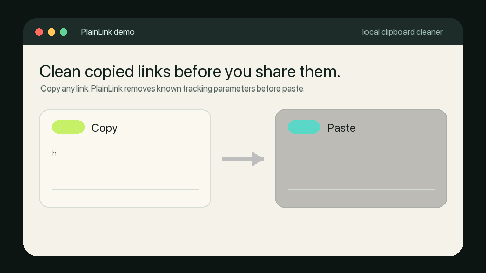
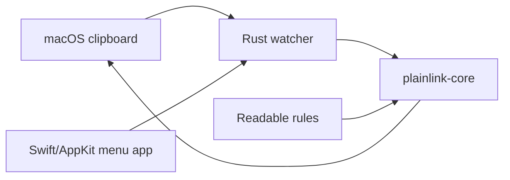

# PlainLink

Clean tracking junk from copied links on macOS.

PlainLink watches the clipboard and removes known tracking parameters before you paste a URL. It runs on your Mac, makes no network requests, and leaves parameters alone unless a rule explicitly marks them as tracking.

[Download the developer preview](https://github.com/HexCodeYT/PlainLink/releases) · [Build from source](#build-from-source) · [Contribute a rule](#contributing-rules)



| Copied | Pasted |
| --- | --- |
| `youtube.com/watch?v=dQw4w9WgXcQ&si=share123&utm_source=copy` | `youtube.com/watch?v=dQw4w9WgXcQ` |
| `amazon.com.au/dp/B08N5WRWNW?tag=affiliate-22&qid=1720000000&th=1` | `amazon.com.au/dp/B08N5WRWNW?th=1` |
| `open.spotify.com/track/4cOdK2wGLETKBW3PvgPWqT?si=abc123` | `open.spotify.com/track/4cOdK2wGLETKBW3PvgPWqT` |

PlainLink accepts links with or without `https://` and keeps the original form.

## Install Preview 5

Preview 5 is for technical testers with an Apple silicon Mac running macOS 11 or later. It is ad-hoc signed but not notarized, so macOS may incorrectly say the app is damaged. A normal drag-and-drop install will not bypass that warning.

1. Download `PlainLink-0.1.0-preview.5-macos-arm64.zip` from [GitHub Releases](https://github.com/HexCodeYT/PlainLink/releases).
2. Unzip it and drag `PlainLink.app` into `/Applications`.
3. Run these commands in Terminal:

   ```sh
   xattr -dr com.apple.quarantine /Applications/PlainLink.app
   open /Applications/PlainLink.app
   ```

PlainLink appears in the menu bar, installs its clipboard watcher, and starts cleaning. When you replace the app with a newer build, the next launch updates the installed watcher too. If you choose **Pause Cleaning**, later launches respect that choice.

The `xattr` command removes the downloaded-file quarantine marker from `PlainLink.app` only. If you would rather not do that, [build the app from source](#build-from-source). Developer ID signing and notarization are still pending.

### Check that it works

Copy this:

```text
youtube.com/watch?v=dQw4w9WgXcQ&si=share123&utm_source=copy
```

Wait half a second, then paste. You should get:

```text
youtube.com/watch?v=dQw4w9WgXcQ
```

If it does not change, open the PlainLink menu and choose **Run Doctor**. **Copy Diagnostics** puts the same report on your clipboard.

## Safety model

Rules list parameters that are safe to remove globally or on a particular domain. Unknown parameters stay in the URL. That matters for invite links, password resets, checkout sessions, signed URLs, playlists, timestamps, and anything else PlainLink does not understand.

The menu includes **Restore Last Original** in case you need the untouched URL.

PlainLink does not use an account, analytics, a server, or a browser extension. The app and its rules live in this repository.

## Build from source

You need Rust and Apple Command Line Tools.

```sh
scripts/test-macos-app.sh
open dist/PlainLink.app
```

The smoke test builds the Rust CLI and native Swift/AppKit menu bar app, verifies the app bundle and its embedded binaries, and writes `dist/PlainLink.app`.

To package a local Preview 5 ZIP:

```sh
PLAINLINK_RELEASE_VERSION=v0.1.0-preview.5 scripts/package-macos-app.sh
```

## Use the CLI

Clean or inspect a URL:

```sh
cargo run -- clean 'youtu.be/LYa_ReqRlcs?si=VC4qVB_EUC90uwbo'
cargo run -- inspect 'example.com/read?utm_source=newsletter&id=42'
```

Work with the clipboard directly:

```sh
cargo run -- clean-clipboard
cargo run -- restore
cargo run -- watch --interval-ms 500
```

Install the watcher and run diagnostics:

```sh
cargo run -- install --interval-ms 500
cargo run -- doctor
cargo run -- agent status
```

## How it fits together


```mermaid
flowchart LR
    Clipboard["macOS clipboard"] --> Watcher["Rust watcher"]
    Menu["Swift/AppKit menu app"] --> Watcher
    Watcher --> Engine["plainlink-core"]
    Rules["Readable rules"] --> Engine
    Engine --> Clipboard
```

The menu app owns status and controls. The Rust CLI handles cleaning, watcher installation, diagnostics, and restore. `rules/base.plainlink` contains the bundled rules, and the fixture files under `tests/fixtures/` lock in expected behavior.

## Development checks

```sh
cargo fmt --check
cargo test
cargo clippy --all-targets -- -D warnings
cargo run --bin plainlink-rules -- verify-fixtures
scripts/test-macos-app.sh
```

Release and architecture notes are in [`docs/RELEASE.md`](docs/RELEASE.md) and [`docs/ARCHITECTURE.md`](docs/ARCHITECTURE.md).

## Contributing rules

Open a rule request with the copied URL, the expected result, and an explanation of why the parameter is safe to remove. Mention any parameters that must stay.

A rule pull request should include a fixture under `tests/fixtures/`. See [`CONTRIBUTING.md`](CONTRIBUTING.md) and [`docs/RULES.md`](docs/RULES.md).

## License

PlainLink is available under the [MIT License](LICENSE).
