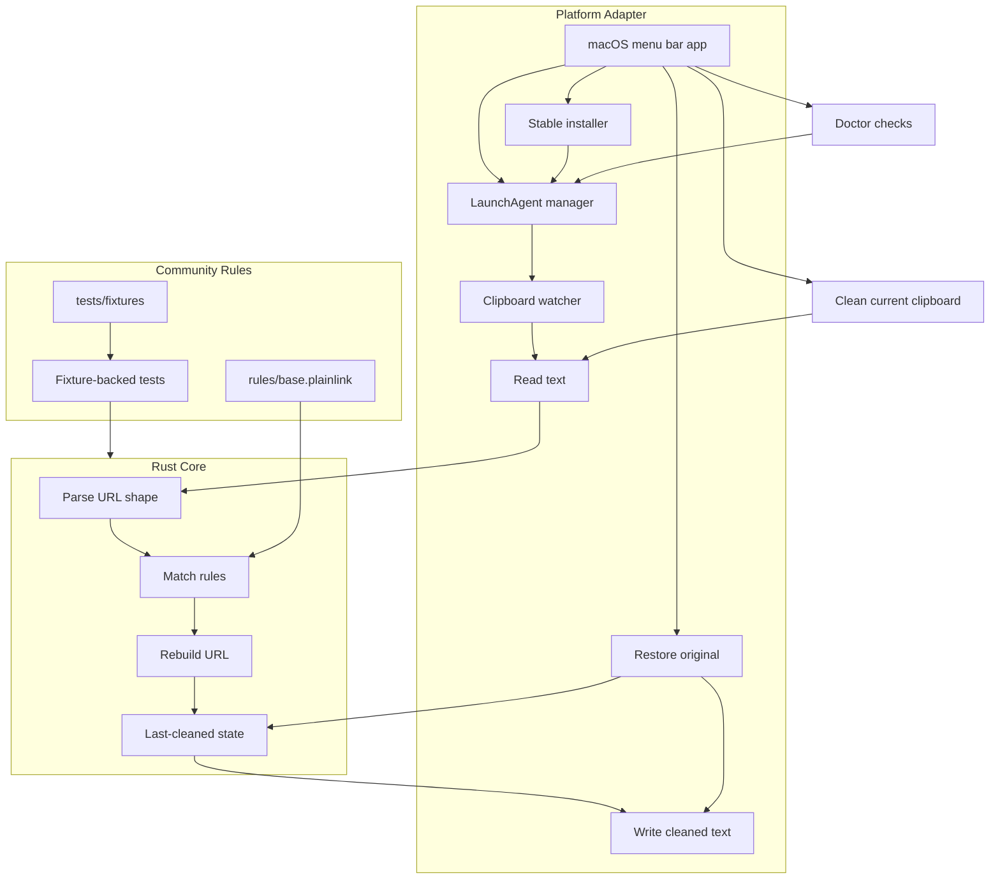
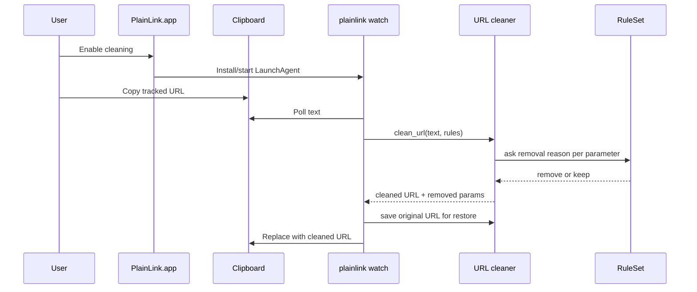
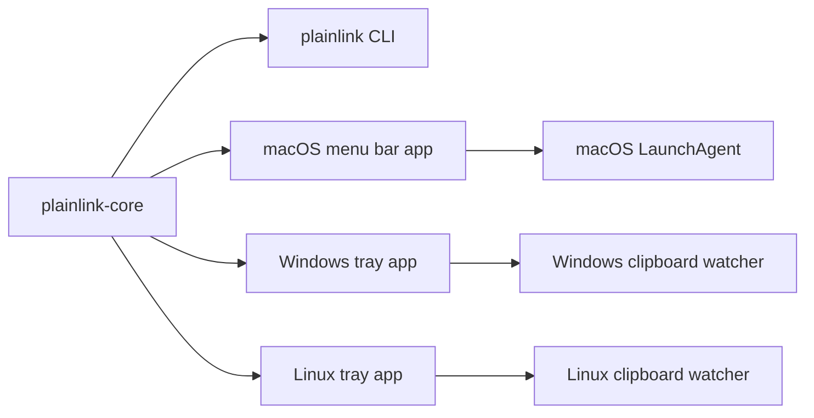

# PlainLink Architecture

PlainLink has two jobs: detect copied URLs and clean them without breaking useful links. The MVP keeps those jobs separate so contributors can improve rules and engine behavior without touching macOS UI or clipboard code.

## Data Flow

## Design Choices

- The Rust core owns URL cleaning, rule parsing, and tests.
- The menu bar app owns user-facing controls and shells out to the CLI.
- The macOS adapter only reads and writes clipboard text.
- Unknown parameters are kept by default.
- The original URL is stored before PlainLink rewrites the clipboard.
- The stable installer copies the binary before pointing LaunchAgent at it.
- LaunchAgent commands install and control the user-level watcher process.
- System-level clipboard cleaning is the product surface; browser extensions are not required for the core app.
- Community rule examples live as fixtures and run through `cargo test`.
- Root is not required; clipboard access belongs to the logged-in user session.
- The MVP uses `pbpaste` and `pbcopy` for a small macOS adapter.

## Future Shape

