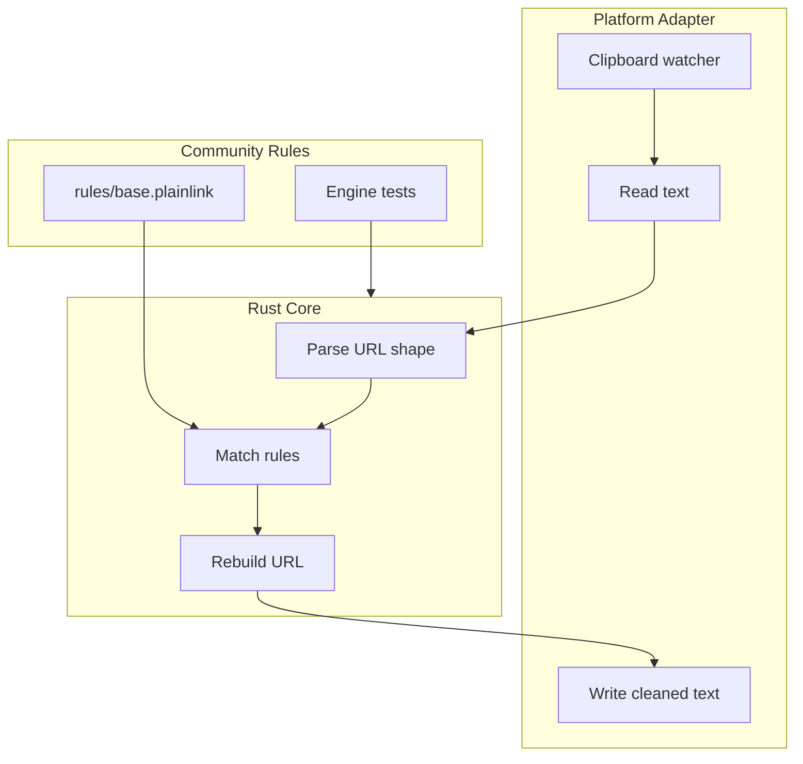
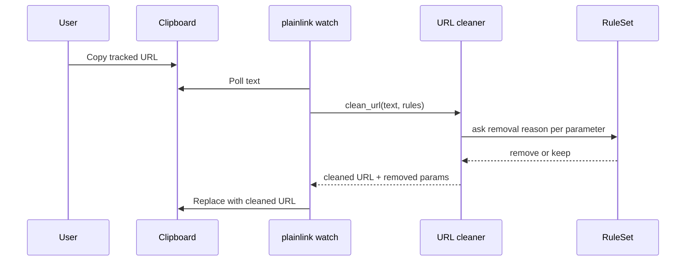
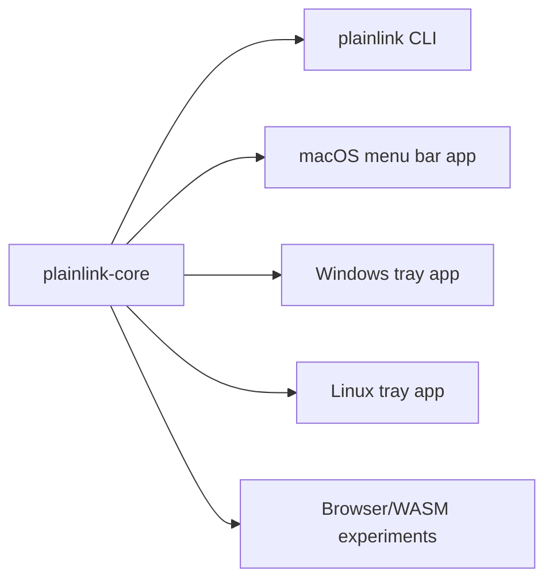

# PlainLink Architecture

PlainLink has two jobs: detect copied URLs and clean them without breaking useful links. The MVP keeps those jobs separate so contributors can improve rules and engine behavior without touching macOS clipboard code.

## Data Flow

## Design Choices

- The Rust core owns URL cleaning, rule parsing, and tests.
- The macOS adapter only reads and writes clipboard text.
- Unknown parameters are kept by default.
- Root is not required; clipboard access belongs to the logged-in user session.
- The MVP uses `pbpaste` and `pbcopy` for a small macOS adapter. A future native menu bar app can reuse the same core.

## Future Shape

