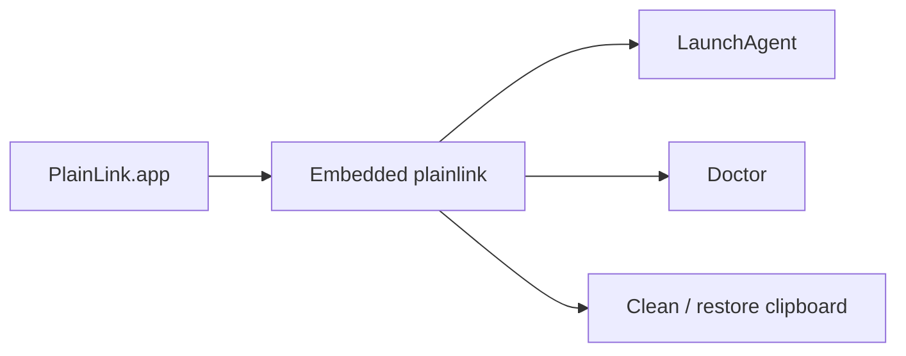
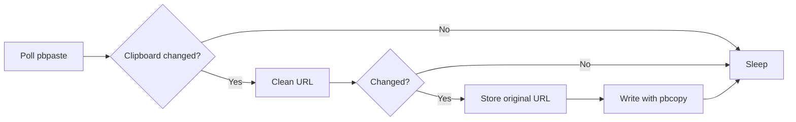

# macOS Notes

PlainLink does not need to run as root. The clipboard belongs to the logged-in user session, so the right macOS shape is a user-level process or LaunchAgent.

## Menu Bar App

Build and smoke-test the native menu bar app:

```sh
scripts/test-macos-app.sh
```

The generated app lives at:

```text
dist/PlainLink.app
```

The app is built with Swift/AppKit and Apple Command Line Tools. It embeds the release Rust CLI, then uses that CLI for all product actions:



Run it from Finder after building, or from the terminal during development:

```sh
dist/PlainLink.app/Contents/MacOS/PlainLinkMenu
```

The app has a smoke-test mode that does not open the UI:

```sh
dist/PlainLink.app/Contents/MacOS/PlainLinkMenu --smoke-test
```

## Run Manually

```sh
cargo run -- watch --interval-ms 500
```

The MVP uses macOS `pbpaste` and `pbcopy` from a Rust watcher loop:



## Restore

When `plainlink watch` or `plainlink clean-clipboard` cleans a URL, it stores the original at:

```text
~/Library/Application Support/PlainLink/last-cleaned.json
```

Restore the last original URL to the clipboard:

```sh
cargo run -- restore
```

Clean the current clipboard once:

```sh
cargo run -- clean-clipboard
```

## LaunchAgent Example

Build the binary, then install the watcher as a user LaunchAgent:

```sh
cargo build --release
target/release/plainlink install --interval-ms 500
```

PlainLink copies the current binary to:

```text
~/Library/Application Support/PlainLink/bin/plainlink
```

Then it writes the LaunchAgent plist to:

```text
~/Library/LaunchAgents/com.plainlink.agent.plist
```

Manage the service:

```sh
PLAINLINK_BIN="$HOME/Library/Application Support/PlainLink/bin/plainlink"
"$PLAINLINK_BIN" doctor
"$PLAINLINK_BIN" agent status
"$PLAINLINK_BIN" agent restart
"$PLAINLINK_BIN" uninstall
```

The generated plist is based on [packaging/macos/com.plainlink.agent.example.plist](../packaging/macos/com.plainlink.agent.example.plist). For lower-level control, use `plainlink agent help`.

## App Controls

The menu bar app provides:

- enable, pause, start, and restart watcher controls,
- interval selection,
- one-shot current clipboard cleaning,
- restore-last-original,
- doctor diagnostics,
- diagnostics copy,
- support and log folder shortcuts.

Signing and notarization are not part of this MVP. See [MENUBAR.md](MENUBAR.md) for app internals.
