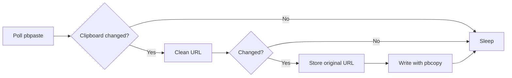

# macOS Notes

PlainLink does not need to run as root. The clipboard belongs to the logged-in user session, so the right macOS shape is a user-level process or LaunchAgent.

## Run Manually

```sh
cargo run -- watch --interval-ms 500
```

The MVP uses macOS `pbpaste` and `pbcopy` from a Rust watcher loop:



## Restore

When `plainlink watch` cleans a URL, it stores the original at:

```text
~/Library/Application Support/PlainLink/last-cleaned.json
```

Restore the last original URL to the clipboard:

```sh
cargo run -- restore
```

## LaunchAgent Example

Build and install the binary somewhere stable, then adapt [packaging/macos/com.plainlink.agent.example.plist](../packaging/macos/com.plainlink.agent.example.plist).

```sh
cargo build --release
```

For a real release, the app should provide a menu bar shell with an enable/disable toggle, restore-last-original action, and autostart management.
