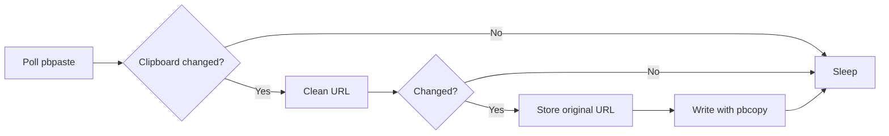

# macOS Notes

PlainLink does not need to run as root. The clipboard belongs to the logged-in user session, so the right macOS shape is a user-level process or LaunchAgent.

## Run Manually

```sh
cargo run -- watch --interval-ms 500
```

The MVP uses macOS `pbpaste` and `pbcopy` from a Rust watcher loop:



## Restore

When `plainlink watch` cleans a URL, it stores the original at:

```text
~/Library/Application Support/PlainLink/last-cleaned.json
```

Restore the last original URL to the clipboard:

```sh
cargo run -- restore
```

## LaunchAgent Example

Build the binary, then install the watcher as a user LaunchAgent:

```sh
cargo build --release
target/release/plainlink install --interval-ms 500
```

PlainLink copies the current binary to:

```text
~/Library/Application Support/PlainLink/bin/plainlink
```

Then it writes the LaunchAgent plist to:

```text
~/Library/LaunchAgents/com.plainlink.agent.plist
```

Manage the service:

```sh
PLAINLINK_BIN="$HOME/Library/Application Support/PlainLink/bin/plainlink"
"$PLAINLINK_BIN" doctor
"$PLAINLINK_BIN" agent status
"$PLAINLINK_BIN" agent restart
"$PLAINLINK_BIN" uninstall
```

The generated plist is based on [packaging/macos/com.plainlink.agent.example.plist](../packaging/macos/com.plainlink.agent.example.plist). For lower-level control, use `plainlink agent help`. For a real release, the app should provide a menu bar shell with an enable/disable toggle and restore-last-original action.
