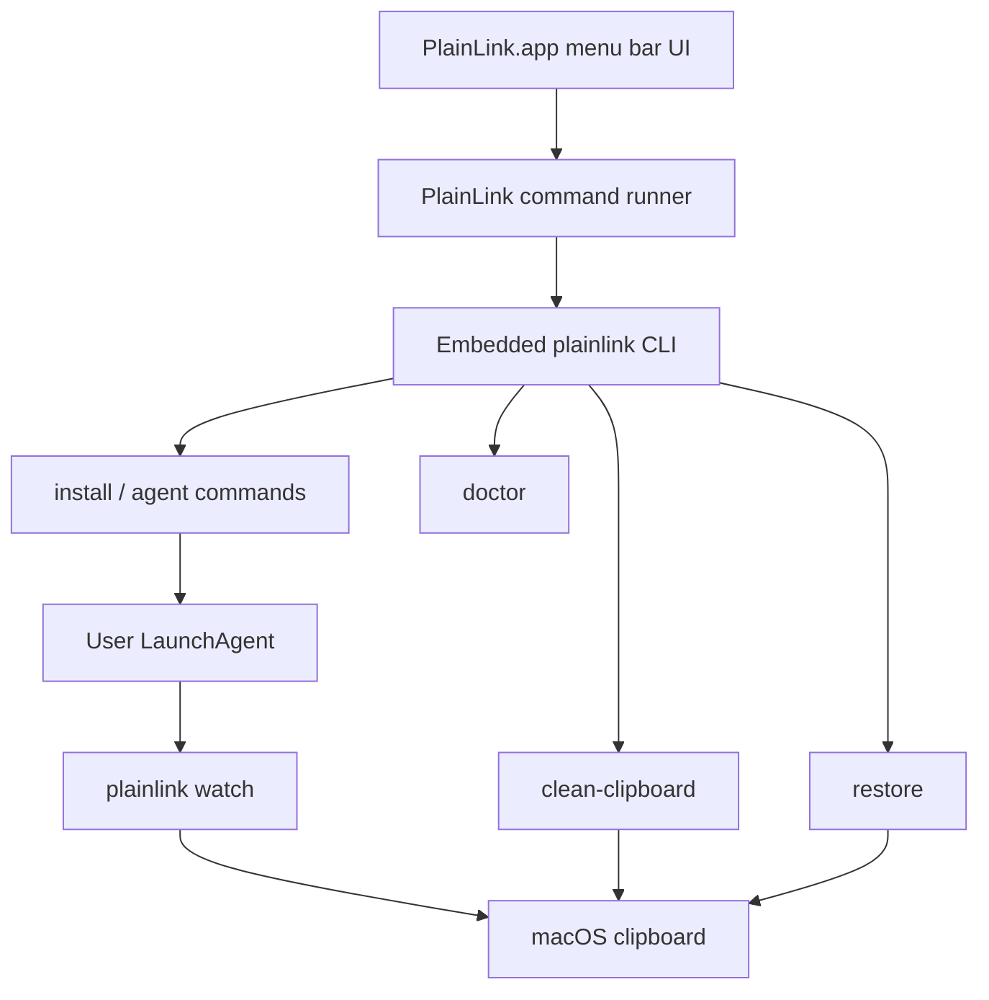

# macOS Menu Bar App

PlainLink includes a native macOS menu bar shell built with Swift and AppKit. It does not need Xcode; Apple Command Line Tools are enough.

The menu bar app is intentionally thin. The Rust CLI remains the engine for cleaning, LaunchAgent management, restore, and diagnostics.

On first launch, the app shows a short explanation and lets the user enable cleaning from the dialog. The same copy is available later from `Getting Started` in the menu.

The app icon is generated during `scripts/build-macos-app.sh` by `scripts/generate-macos-icon.sh`. The generated `PlainLink.icns` is bundled into `Contents/Resources` and referenced by `CFBundleIconFile`.

## Build

```sh
scripts/build-macos-app.sh
```

The script creates:

```text
dist/PlainLink.app
```

The app bundle contains:

```text
Contents/MacOS/PlainLinkMenu   Native AppKit status bar app
Contents/MacOS/plainlink       Release Rust CLI used by the app
Contents/Resources/PlainLink.icns App icon
Contents/Info.plist            LSUIElement menu bar app metadata
```

## Smoke Test

```sh
scripts/test-macos-app.sh
```

This builds the bundle, validates `Info.plist`, confirms both executables exist, runs the menu app smoke test, and checks the embedded CLI version command.

## Package

```sh
scripts/package-macos-app.sh
```

The package script rebuilds and smoke-tests the app, then writes:

```text
dist/packages/PlainLink-<version>-macos-<arch>.zip
dist/packages/PlainLink-<version>-macos-<arch>.zip.sha256
```

The zip is unsigned and not notarized. It is meant for technical testers and GitHub Actions artifacts, not regular-user distribution.

Verify a downloaded package:

```sh
cd dist/packages
shasum -a 256 -c PlainLink-<version>-macos-<arch>.zip.sha256
```

Signed and notarized release builds are produced by `scripts/release-macos-app.sh` on a machine with Developer ID credentials. See [RELEASE.md](RELEASE.md).

## Runtime Flow



## Menu Actions

- Enable, pause, start, and restart clipboard cleaning.
- Select watcher interval.
- Clean the current clipboard once.
- Restore the last original URL.
- Run doctor diagnostics.
- Copy diagnostics to the clipboard.
- Show getting-started guidance.
- Open support and log folders.
- Quit the menu bar app without stopping the LaunchAgent.

## Design Notes

- The app is a user-level status bar app with `LSUIElement`.
- The first-run dialog is intentionally short and can enable cleaning directly.
- The app icon is generated from reviewable Swift drawing code instead of a checked-in binary source asset.
- The app shells out to the embedded `plainlink` binary instead of duplicating core logic.
- `plainlink install` copies the embedded CLI to the stable user path before starting the watcher.
- Pausing uses `plainlink agent uninstall`, which stops the watcher without deleting the installed binary.
- Full uninstall remains available through the CLI with `plainlink uninstall`.
- Signed and notarized release builds are documented in [RELEASE.md](RELEASE.md).
