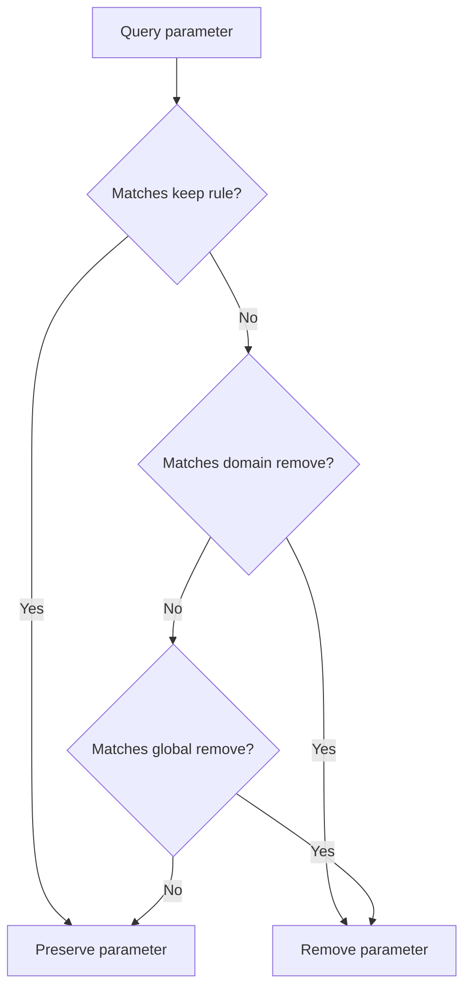

# PlainLink Rule Format

PlainLink rules are line-based and designed for review in pull requests.

```text
[global]
remove = utm_*, fbclid

[domain:youtube.com]
remove = si
keep = v, list, t
```

## Syntax

- `[global]` applies to every supported URL.
- `[domain:example.com]` applies to `example.com` and its subdomains.
- `remove = name` removes an exact query parameter.
- `remove = prefix_*` removes any query parameter with that prefix.
- `keep = name` protects a parameter even if another rule would remove it.
- Lines starting with `#` are comments.

## Rule Evaluation



## Safety Principles

- Preserve unknown parameters.
- Prefer domain-specific rules for short names such as `si`, `ref`, or `tag`.
- Avoid removing auth, token, signature, checkout, invite, reset, or expiry-looking parameters unless the domain behavior is proven safe.
- Include before and after URLs in every rule proposal.

## Examples

YouTube short link:

```text
Before: https://youtu.be/LYa_ReqRlcs?si=VC4qVB_EUC90uwbo
After:  https://youtu.be/LYa_ReqRlcs
Rule:   [domain:youtu.be] remove = si
```

Generic campaign tracking:

```text
Before: https://example.com/read?utm_source=newsletter&id=42
After:  https://example.com/read?id=42
Rule:   [global] remove = utm_*
```
