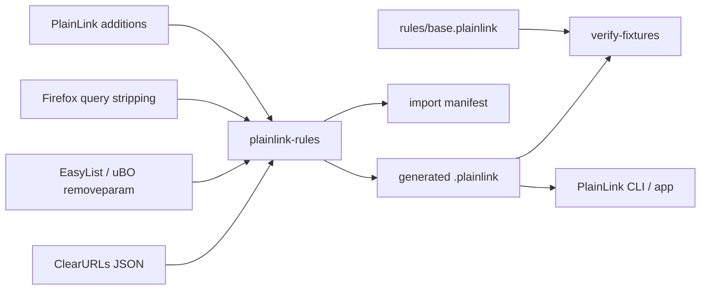

# External Rule Sources

PlainLink should not maintain a duplicate database of tracking parameters when mature privacy projects already maintain that knowledge. The long-term shape is to compile trusted external sources into PlainLink's small runtime format.



## Current Status

The first importer supports a conservative ClearURLs subset:

```sh
plainlink-rules import-clearurls \
  --input clearurls-data.minify.json \
  --output rules/generated/clearurls.plainlink \
  --manifest rules/generated/clearurls.manifest \
  --source-revision <upstream-sha>
```

It imports only providers that can be represented safely in `.plainlink`:

- concrete domains extracted from common ClearURLs `urlPattern` regexes,
- simple exact query parameter names,
- simple prefix regexes like `pk_.*`, converted to `pk_*`,
- `referralMarketing` fields as removable parameters.

It skips:

- providers with exceptions, because `.plainlink` does not yet have path-level allow rules,
- wildcard-TLD provider patterns,
- `completeProvider` rules,
- raw URL regex rules,
- redirections,
- parameter regexes that cannot be represented as exact or prefix rules.

That makes the importer incomplete by design, but safe. It is better to import fewer rules than to over-clean checkout, login, redirect, invite, or signed URLs.

## Safety Gate

Generated source rules need two checks before they can ship:

```sh
plainlink-rules verify-fixtures
plainlink-rules verify-fixtures --rules rules/generated/clearurls.plainlink
```

The first command proves native rules still satisfy the fixture corpus. The second command merges generated rules with native rules and fails on any fixture regression.

Each import can also write a deterministic manifest:

```text
source_name = ClearURLs Rules
source_url = https://rules2.clearurls.xyz/data.minify.json
source_revision = <upstream-sha>
input_sha256 = <sha256>
output_sha256 = <sha256>
providers_seen = 184
providers_imported = 121
providers_skipped = 63
rules_imported = 846
rules_skipped = 392

[skip_reasons]
exceptions = 12
wildcard_tld = 8
complete_provider = 2
unsupported_domain_regex = 31
unsupported_param_regex = 392
```

The manifest is for releases, CI logs, and review. It records exactly which upstream input produced the generated `.plainlink` output and why unsupported rules were rejected.

## Source Metadata

External source definitions live in:

```text
rules/sources.toml
```

Generated third-party rules should not be committed by default until redistribution terms are reviewed. Source metadata should include:

- upstream URL,
- hash URL if available,
- homepage,
- license note,
- whether generated output is vendored.

## ClearURLs

ClearURLs documents `data.minify.json` as the current generated rule catalog and recommends the hosted rules URLs:

```text
https://rules2.clearurls.xyz/data.minify.json
https://rules2.clearurls.xyz/rules.minify.hash
```

ClearURLs providers can include `urlPattern`, `rules`, `rawRules`, `referralMarketing`, `exceptions`, `redirections`, and `forceRedirection`. PlainLink currently imports only the query-parameter subset.

Reference: https://docs.clearurls.xyz/1.23.0/specs/rules/

## EasyList And uBlock Origin

EasyList, EasyPrivacy, and uBlock lists are useful future sources, especially for adblock-style query parameter stripping rules. PlainLink should not attempt to parse the entire adblock syntax first. The useful first subset is remove-parameter behavior.

EasyList licensing needs explicit handling before generated rules are redistributed. EasyList documents repository content as GPLv3-or-later or CC BY-SA 3.0-or-later unless otherwise noted.

Reference: https://easylist.to/pages/licence.html

## Firefox Query Stripping

Firefox maintains query parameter stripping through preferences and a Remote Settings collection. Some records include filter expressions, so this should be a separate importer rather than a plain global list.

Reference: https://firefox-source-docs.mozilla.org/toolkit/components/antitracking/anti-tracking/query-stripping/index.html

## Design Rule

The runtime should keep reading `.plainlink`.

Importers can become complex. The clipboard watcher, menu bar app, and URL cleaner should not.
